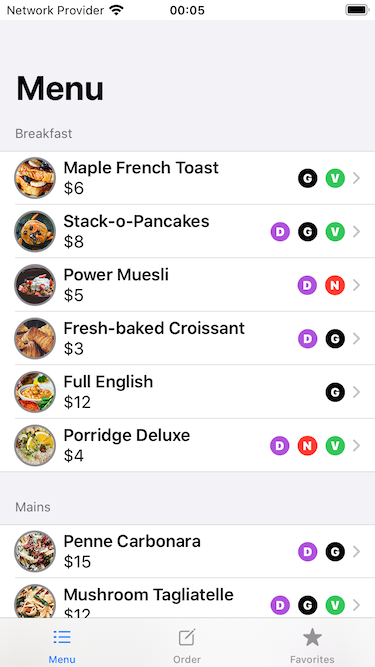
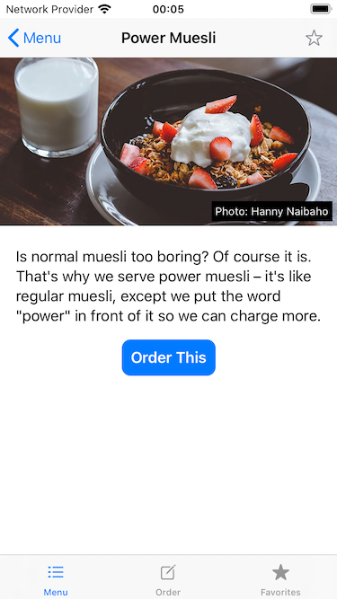
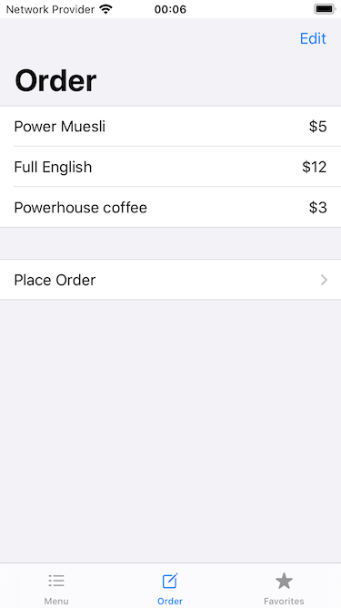
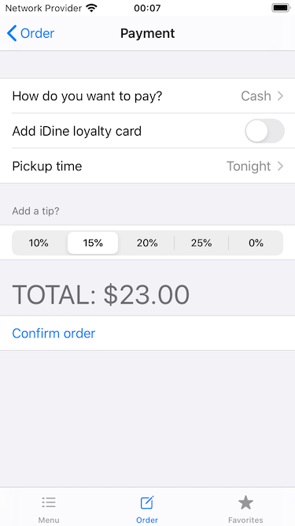
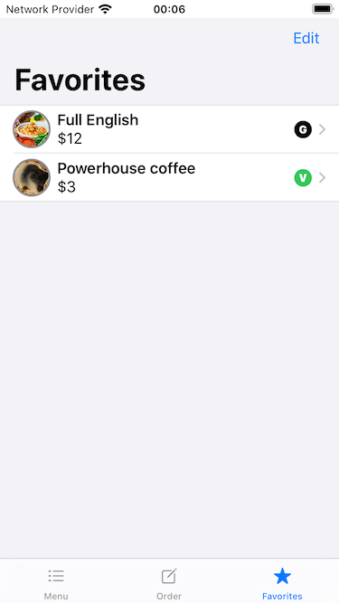

# SwiftUI-iDine

This Xcode project is created based on the "Hacking With Swift" tutorial for SwiftUI.
Specifically it follows the section "Building a complete project" of the 
[SwiftUI quick-start guide](https://www.hackingwithswift.com/quick-start/swiftui), with the goal
to write a restaurant app that lists items in a menu and helps folks place orders.

My solution also includes the three optional challenges given at the end of the tutorial:

1. Customize the “Order This” button with a custom font, background, and more.
2. Add “Pickup time” to `CheckoutView`, with the options “Now”, “Tonight”, and “Tomorrow Morning”.
3. Add a Favorite navigation bar item to `ItemDetail` and a Favorites tab showing them all.

## Screeshots

 

 

